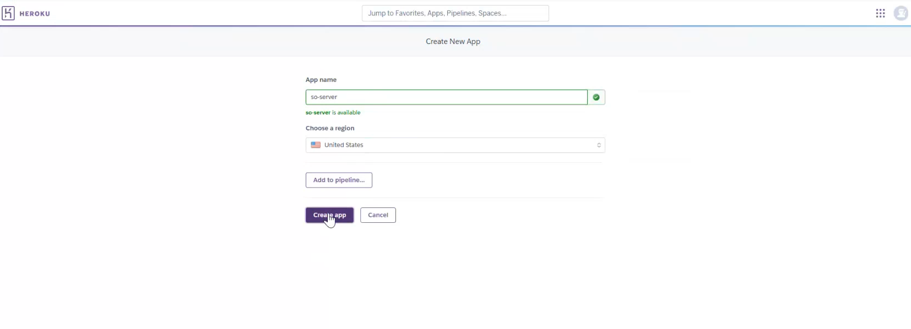
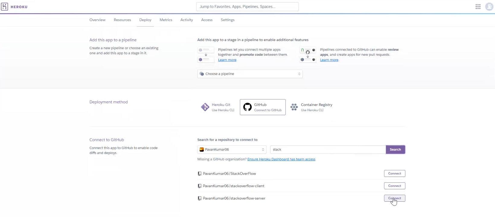
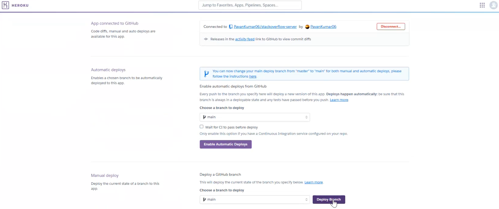
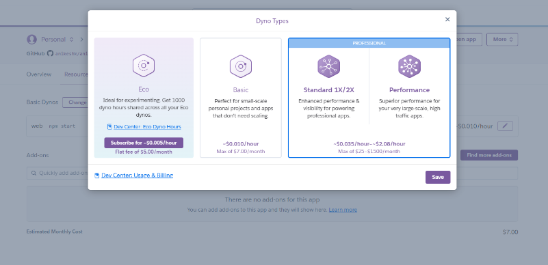
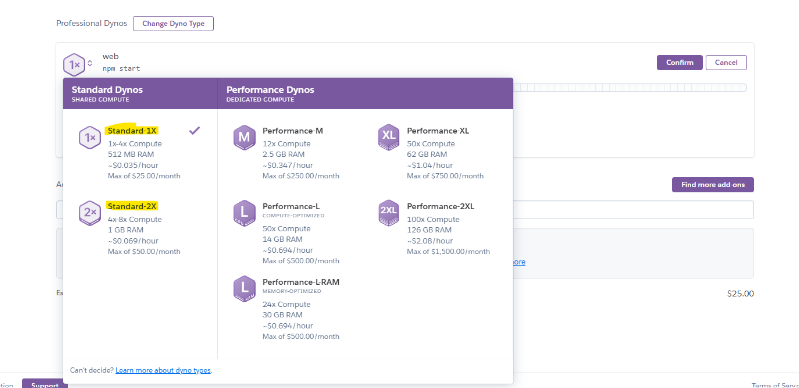

# Continuous Deployment Pipeline for FakeStackOverFlow

In this activity, you will set up a continuous deployment pipeline using MongoDB Atlas and Render.com. The application will be deployed through Render.com, while the MongoDB database will be hosted in the cloud using MongoDB Atlas.

Only one member of each team needs to complete these steps, as the resulting deployment will be shared with the entire team. However, if preferred, the team can work together to deploy the application.

{: .note } 
In this activity, we will focus on building a continuous deployment pipeline, but what about continuous integration? There are many ways to use continuous integration in your projects. For example, you can use GitHub Actions to automatically run tests after pushing a commit. FakeStackOverflow has a continuous integration setup for running tests, and you can find the workflow in `.github/workflows/main.yml`.

## Pre-Requisites

There are three pre-requisites for this activity.

### GitHub Repository

Your team's deployment must take place within a private GitHub repository in our GitHub Classroom. To create your repository, each member of your team should follow these instructions:

1. Sign in to GitHub.com, and then use [our invitation](https://classroom.github.com/a/L65hxlBf) to create a repository with the FakeStackOverflow codebase. Check to see if one of your groupmates has created a group already - if so, select it to join it. Otherwise, create a repo using the following format fall24-team-project-group-xyy where you should enter your group number (e.g. "Group-XYY") as the name where X is your section number and YY is your group number.

2. Check your email for the invitation to join the repo. After that, refresh the page, and it will show a link to your new repository, for example: https://github.com/neu-cs4530/fall24-team-project-group-xyy. Click the link to navigate to your new repository. This is the repository you will use for the project.

This repository will be private, and visible only to your team and the course staff. After the semester ends, you are welcome to make it public - you have complete administrative control of the repository.

If you run into the error "refusing to allow an OAuth App to create or update workflow" when trying to push to GitHub, the fix is to update your saved authentication credentials for GitHub. For instance, you can follow [these instructions](https://docs.github.com/en/github/using-git/updating-credentials-from-the-macos-keychain) to update your credentials in the MacOS Keychain. If all else fails, you can connect to GitHub with [SSH instead of HTTPS](https://docs.github.com/en/github/authenticating-to-github/connecting-to-github-with-ssh), which will also solve this problem. This error seems to only occur when pushing a change to the GitHub Actions configuration file, so you could also side-step the problem by having a team mate push this change to GitHub instead (who may not run into this issue).

### MongoDB Account

MongoDB Atlas is a cloud-based service that provides fully managed MongoDB databases. It allows you to easily deploy, manage, and scale MongoDB clusters without needing to handle server infrastructure, security, backups, or updates, making database management simpler and more efficient.

To use MongoDB Atlas, create a MongoDB account [here](https://account.mongodb.com/account/register).

After you register you will be asked to verify your email. The steps on how to create a MongoDB database and configure are provided below.

### Render.com Account

Render.com is a cloud platform that simplifies deploying and hosting web applications, APIs, and databases. It automatically manages servers, scaling, and security, allowing developers to easily build, deploy, and run applications without worrying about infrastructure management.

You can create a Render.com account [here](https://dashboard.render.com/register). Clicking on the "GitHub" button and sign up using the **same GitHub account** as the one used to create the GitHub project repository.

After you register you will be asked to verify your email. You might be asked to authorize the Render app for the "neu-cs4530" organization - choose your repository using the "Only select repositories" option, DO NOT choose "All repositories".

## Steps

You will first create the MongoDB database, and then setup the continuous deployment pipeline for the server and the client.

### Setup your MongoDB Database

1. Navigate to your [MongoDB Account Profile](https://account.mongodb.com/account/profile/overview).
2. Click on the "Visit MongoDB Atlas" button.
3. Click on the "Create" button on the center of the screen. (If you don't see a "Create" button, make sure you are in the "Overview" section on the left navigation and on the "Data Services" tab)
4. In the configuration options:
   1. Choose the "M0" free tier.
   2. For the Name, provide a name such as "db-cs4530-f24-XYY" (where XYY is your group number).
   3. Keep the Provider and Region the default values.
5. Click on "Create Deployment".
6. You will be prompted about connecting to your database. 
   1. Copy the username and password that is automatically generated. You will need this later (you can also create an user after the database has been created).
   2. Click on "Create Database User".
   3. Click the "Close" button.
7. Wait for your database cluster to complete creation. Once complete, click on the "Network Access" option in the left navigation.
8. Your current public IP address will be automatically present. Click the "EDIT" button, and then click "ALLOW ACCESS FROM ANYWHERE". Click the "Confirm" button.
9. Click on the "Database" option in the left navigation. Then, click on the "Connect" button.
   1.  Click on "Choose a connection method".
   2.  Click on "Compass".
   3.  If you don't have Compass installed, follow the instructions to install MongoDB Compass and then connect.
   4.  Otherwise, switch to the "I have MongoDB Compass installed" tab and connect.
10. Open up MongoDB Compass and see what connections are displayed.  You should see a connection to something like `<your repo name>.cvjdm.mongodb.net:27017` That connection should include databases such as such as "admin", "config", and "local".
11. In Compass nav bar (on the left), select the connection you just created.  Mouse to the "..." and select "Copy Connection String".  Paste this connection string in some convenient place; you will need it later.
12. Go to your project repository's server folder and run the `populate_db.ts` script.

```
cd server
npx ts-node populate_db.ts <your connection string>/fake_so
```
You can find the connection string in the instructions from step 11.

When you are done, go back to Compass and examine the connection you created.  When you open that connection, you should see a database named `fake_so`, and in that database you should see collections named `Answer`, `Comment`, `Question`, and `Tag` with several documents in each of them, much like you got when running `populate_db.ts` locally.

You have now completed setting up your MongoDB database.


{: .note } 
For simplicity, and since you're not handling sensitive data, the Network Access is set to allow connections from anywhere. However, for projects involving sensitive data, you should restrict access to only the necessary range of IP addresses.

You can connect your locally deployed server to the cloud-hosted MongoDB database. This is useful when developing a feature and testing it before deployment. To do this, update the `.env` created as [part of the IP2 setup](https://neu-se.github.io/CS4530-Fall-2024/assignments/ip2#task-0-setup-environment-variables).

```
MONGODB_URI=<add your connection string here, without the trailing slash>
CLIENT_URL=http://localhost:3000
PORT=8000
```

Note: The .env file is not required for the Render.com setup. The above instructions are only if you want to connect the cloud MongoDB to your local (laptop) server.

### Setup your Server

1. Open the [Render Dashboard](https://dashboard.render.com/).
2. Click on "Create new project", and create a new project with a name such as "cs4530-f24-XYY" (where XYY is your group number).
3. From the top menu, click on the "+ New" button and click on "Web Service".
   1. For the Source Code, choose your project repository. In case you do not see your project repository, go to your GitHub account and authorize access to your project repository.
   2. For the Name, you can EITHER choose an unique name OR use a name such as "cs4530-f24-XYY-API" or "cs4530-f24-XYY-backend"(where XYY is your group number). The "API" or "backend" in that name is important, because it will let you easily distinguish the "server" (what Render calls a "web service") from the "client" (what Render calls a "static site", which is the URL where you will find the user-facing application).
   3. For the Project, select the project created earlier. For the environment, select Production or any default value.
   4. For Language, select "Node".
   5. For Branch, select "main".
   6. For Region, keep the default value.
   7. For Root Directory, type in "server".
   8. For Build Command, type in "npm install && tsc".
   9. For Start Command, type in "npm run start:prod".
   10. For Instance Type, choose the "Free" option.
   11. In the Environment Variables section, add a variable called `MONGODB_URI`. For the value, add the connection string of the MongoDB database created earlier. Make sure that you remove the trailing slash, if any.
   12. If you need to change any of these, you can do so from the tab called "Settings" (or "Environment")
4. Click "Deploy Web Service".  
5. The URL of the backend service will be displayed in purple just below near the top of the window in the "Logs" section.  Make a copy of this; you will need it later.
7. Once the deployment is completed, visit the URL and check if you get a "hello world" response. 
8. Append `/question/getQuestion?order=newest&search=` to the URL and check if you get an successful response. A successful response should include the questions that are present in your MongoDB.  If you get something like ` MongoDB connection error:  MongooseServerSelectionError: connect ECONNREFUSED 127.0.0.1:27017`, that indicates that your server is trying to connect to your local database.   Check that the value of `MONGODB_URI` is set correctly in the Render environment section. 
9. You can check the server's logs by going to the "Logs" section.


{: .note } 
You might see a warning like this after the server deployment:
```Your free instance will spin down with inactivity, which can delay requests by 50 seconds or more.```
In case your server is is not responding to requests after a long period of inactivity, visit the URL and wait till you get a "hello world" response. If the server is still not responsive, then check the logs.


### Setup your Client

1. Open the [Render Dashboard](https://dashboard.render.com/).
2. From the top menu, click on the "+ New" button and click on "Static Site".
3. For the Git Provider, choose your project repository. In case you do not see your project repository, go to your GitHub account and authorize access to your project repository.
4. For the Name, you can either choose an unique name OR use a name such as "cs4530-f24-XYY" (where XYY is your group number).  
5. For the Project, select the project created earlier. For the environment, select Production or any default value.
6. For Branch, select "main".
7. For Root Directory, type in "client".
8. For Build Command, type in "npm install && npm run build".
9. For Publish directory, type in "build".
10. In the Environment Variables section, add a variable called `REACT_APP_SERVER_URL`. For the value, add the server URL from **Setup your Server** Step 5.   
11. Click "Deploy Static Site".
12. Once the site is deployed, copy the client URL. As before, you can find this in purple near the top of the "Logs" page.
13. Open the [Render Dashboard](https://dashboard.render.com/) again. Choose the project you have created, and go back to service called "Web Service". 
14. Click on the "Environment" tab.
15. Add a new environment variable called `CLIENT_URL`. For the value, add the client URL (make sure you are adding this env. variable in the server's settings, not the client's). You should now have two environment variables for your server: `MONGDB_URI` and `CLIENT_URL`.
16. Visit the client URL in your browser to run the application.


## Alternative Steps to Set Up Heroku Deployment for Your Backend Service

### Step 1: Enroll in GitHub Student Developer Pack and Heroku for Students

1. **Enroll in GitHub Student Developer Pack**
   * Visit GitHub Education and select **"Get student benefits"**. Follow the instructions to apply. Approval can take up to 2 business days.

2. **Set Up Heroku for Students**
   * Go to Heroku.com and create an account (use the same email as your GitHub account).
   * Enroll in the Heroku for Students offer, which requires the GitHub Student Developer Pack.
      * **Note**: You'll need to add a credit card for the platform credits that Heroku provides for student use.
   * After approval, you should see these credits in the billing section of your Heroku account within a few hours. **Wait to create an app until credits are available.**

### Step 2: Create a New Application on Heroku

1. **Navigate to the Heroku Dashboard**
   * After logging into Heroku, go to your Dashboard.

2. **Create a New App**
   * Select **New -> Create New App**.
   * Choose a descriptive app name (this will form part of your app's URL).
   * Click **Create App** to proceed.

   

### Step 3: Deploy the Server from a New Repository

1. **Create a New Private Repository**
   * You must create a new Private Repository on Github which will contain only your server code.
   * Create a new Private Repository on Github and copy paste your server folder.
   * Copy the .gitignore from the root of the original repository to the server repository.

2. **Update Yaml file**
   * Once the client and server folders are separated into different repositories, update the .github\workflows\main.yml in each as the following:

   **Client - GitHub Actions CI Workflow Configuration**

      ```yaml
      name: FakeStackOverflow CI
      on: # Controls when the action will run.
      # Triggers the workflow on push or pull request events but only for the master branch. If you want to trigger the action on other branches, add here
      push:
         branches: [main]
      pull_request:
         branches: [main]

      # Allows you to run this workflow manually from the Actions tab
      workflow_dispatch:

      # A workflow run is made up of one or more jobs that can run sequentially or in parallel
      jobs:
      build-and-test: #
         # The type of runner that the job will run on
         runs-on: ubuntu-20.04

         # Steps represent a sequence of tasks that will be executed as part of the job
         steps:
            - name: Git Checkout
            uses: actions/checkout@v4

            - name: Set up Node.js 20.x
            uses: actions/setup-node@v4
            with:
               node-version: "20.x"

            - name: Build and lint frontend
            if: ${{ always() }}
            env:
               REACT_APP_SERVER_URL: http://localhost:8000
            run: cd client; npm ci && npm run build && npm run lint
      ```
   
   **Server - GitHub Actions CI Workflow Configuration**

      ```yaml
      name: FakeStackOverflow CI
      on: # Controls when the action will run.
      # Triggers the workflow on push or pull request events but only for the master branch. If you want to trigger the action on other branches, add here
      push:
         branches: [main]
      pull_request:
         branches: [main]

      # Allows you to run this workflow manually from the Actions tab
      workflow_dispatch:

      # A workflow run is made up of one or more jobs that can run sequentially or in parallel
      jobs:
      build-and-test: #
         # The type of runner that the job will run on
         runs-on: ubuntu-20.04

         # Steps represent a sequence of tasks that will be executed as part of the job
         steps:
            - name: Git Checkout
            uses: actions/checkout@v4

            - name: Set up Node.js 20.x
            uses: actions/setup-node@v4
            with:
               node-version: "20.x"

            - name: Launch MongoDB Server
            uses: supercharge/mongodb-github-action@1.11.0
            with:
               mongodb-version: "7.0"

            - name: Build backend service
            if: ${{ always() }}
            run: cd server; npm ci

            - name: Test backend server
            if: ${{ always() }}
            env:
               # Pass the environmental variables for the backend tests to use
               MONGODB_URI: mongodb://localhost:27017
            run: |
               cd server

               npm run start & sleep 10

               echo "Checking if the server is running..."
               curl --fail 'http://localhost:8000/question/getQuestion?order=newest&search=' || (echo "Server failed to start" && killall node && exit 1)

               echo "Server started successfully. Now stopping..."
               killall node

               npm run test

            - name: Lint backend
            if: ${{ always() }}
            run: cd server; npm run lint
      ```

### Step 4: Connect to GitHub for Continuous Deployment

1. **Connect to GitHub Repository**
   * In your Heroku app dashboard, scroll to the **Deployment method** section and select **GitHub**.
   * Click **Connect to GitHub** and search for your repository.
   * Select the repository containing your backend service code.

   

2. **Configure Required Files**
   * You need to make these changes to the package.json
     * Move "dotenv" from the "devDependecies" to "dependencies".
     * Change the "start" script in your server/package.json from "ts-node server.ts" to "node dist/server.js".
     * Add a new script called "start:dev" with the value "ts-node server.ts". You can use this for your local development.
   * The package.json file should look something like this:
     * [`package.json`](Module13Assets/package.json) - Should contain required dependencies and scripts, along with the dependencies you have added

   * You need to make these changes to the tsconfig.json
     * Go to server/tsconfig.json and scroll to the end. Modify the "include" and "exclude" values, as specified in the tsconfig.json:
     ```json
      "include": ["./**/*.ts"],
      "exclude": ["node_modules", "dist"]
     ```
   * The tsconfig.json file should look something like this:
     * [`tsconfig.json`](Module13Assets/tsconfig.json) - TypeScript configuration

### Step 5: Deploy the Code

1. **Manual Deployment**
   * Configure the Manual deploy option in Heroku. Everytime you push a change to your main branch, you will have to login to Heroku and click on the Deploy Branch button.
   * In Heroku, scroll to the **Manual deploy** section.
   * Choose the main (or preferred deployment) branch.
   * Click **Deploy Branch** to deploy your application manually.

    

2. **Automatic Deployment Option**
   * Configure the Automatic deploy option in Heroku. Everytime you push a change to your main branch, Heroku will automatically publish your changes.
   * In Heroku, scroll to the **Automatic deploys** section.
   * Choose the main (or preferred deployment) branch.
   * Click **Enable Automatic Deploys** to deploy your application automatically.

### Step 6: Environment Variables

1. **Set Up Environment Variables**
   * In your Heroku dashboard, go to **Settings -> Config Vars**
   * Add your MongoDB connection string as a config var:
     ```
     Key: MONGODB_URI
     Value: <your MongoDB connection string>

     Key: PORT
     Value: 8000

     Key: CLIENT_URL
     Value: <your Render Client URL>
     ```
   * Make sure your MongoDB connection matches the URI in your Mongo Cloud.

### Step 7: Update Client Environment Variables on Render.com

Update the server URL from the Render.com URL to the Heroku URL.

1. **Open the Render Dashboard.**
2. Choose the project you have created and go back to the service with type "Static Site" (your client deployment).
3. Click on the **Environment** tab.
4. Change the value of the `REACT_APP_SERVER_URL` environment variable to the Heroku URL (you can find this in your Heroku app's **Settings** page, under the **Domains** section).
5. After the client finishes re-deploying, check if the client is sending queries to the new Heroku server deployment successfully.
6. *(Optional)* If the new Heroku server deployment is working correctly, delete the server deployment from Render.

### Step 8: *(Optional)* Update Dyno Type for Memory Issues

In case you are still running into memory issues in the Heroku deployment, you can update the "Dynos" type.

1. Follow the steps from [Heroku Help - Change Dyno Types](https://help.heroku.com/XX3MKY2E/how-do-i-change-the-dyno-types-for-my-application) to adjust the dyno type for your application.
2. **Choose the type carefully** as selecting a higher type will result in a higher cost, which will reduce your Platform Credits.



