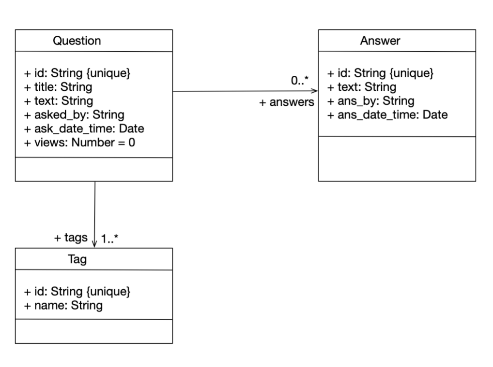

Welcome aboard to the Stack Overflow team! We're glad that you're here and ready to join our development team as a new software engineer.
We're building an interactive application for online community to share their knowledge and experience, and are very happy to see that we have so many new developers who can help make this application a reality.
By the end of the semester, you'll be able to propose, design, implement and test new features for our project.
We understand that some of you may have some web development experience, but don't expect that most of you do, and hence, have created an individual project to help you get up to speed with our existing codebase and development environment.

FakeStackOverFlow is a web application that consists of some code that runs in each client's web browser, and also code that runs on a server.

This implementation effort will be split across two deliverables. In this first deliverable, you will implement and test the core backend components for this feature, and in the second deliverable, you will implement and test the frontend components. 

## Objectives of this assignment
The objectives of this assignment are to:
*  Get you familiar with the basics of TypeScript, VSCode, and the project codebase
*  Learn how to read and write code in TypeScript
*  Translate high-level requirements into code
*  Learn how to write unit tests with Jest

## Getting started with this assignment

Start by accepting our [invitation](https://classroom.github.com/a/ofMQDAQs). It will create a Github repository for you which will include the starter code for this assignment.


### 1. Prerequisites

#### 1.1 Install Node.js and npm

If you haven't installed npm and node.js, follow the [tutorial on setting up a development environment for this class]({{site.baseurl}}) 

#### 1.2 Install MongoDB

We use MongoDB as the NoSQL database to store data related to this application.  
 
1. Follow the [instructions in the official MongoDB documentation](https://www.mongodb.com/docs/manual/administration/install-community/) to install the free community edition.
2. Choose 'Install on Linux', 'Install on macOS', or 'Install on Windows', depending on your system.
3. Scroll down to the section labeled 'Install MongoDB Community Edition.'and to [MongoDBDownload Center](https://www.mongodb.com/try/download/community?tck=docs_server).
4. For Windows, in the Package dropdown, select `msi`.  Then download and run the installer.
5. On Windows, select the _“Install MongoDB as a Service”_ checkbox and install.  This will start MongoDB as a background service.
6. Install "MongoDB Compass" if prompted.
7. Verify if the MongoDB server is running using the Windows Services app.
   
Mongo offers several methods of interacting with your Mongo databases.

* MongoDB Compass is an interactive application for creating, modifying, and querying MongoDB connections.  It should be started as part of the installation process, showing a connection to `mongodb://localhost:27017/`.

* Mongo shell (*mongosh*) provides a command-line interface that can be used to interact with databases in MongoDB. Download it [here](https://www.mongodb.com/try/download/shell) using the msi package. You can also use *mongosh* to see if the MongoDB server is running.  Try the MongoDB Community Edition and the command `show dbs`; you should see a list of existing databases in your local instance.

* Last and most important, you can use the [Mongoose api](https://mongoosejs.com/docs/index.html) to interact with MongoDB through your Javascript or Typescript programs.  Mongoose will be installed as part of the installation process for the project starter code.

### 2. Install the starter code and its dependencies

The starter code package, of which this is a part, is divided into 3 main directories: _client_, _server_, and _testing_. 

1. Navigate to the root directory of the repo.
2. Install the dependencies for each directory by running the following commands:

```shell
cd client/
npm install
cd ../server
npm install
cd ../testing
npm install
```

### 3. Populate the initial database

1. In the `server` directory, run `npx ts-node populate_db.ts mongodb://127.0.0.1:27017/fake_so` to populate the `fake_so` database with data that follows the schema definition.

### 4. Familiarize Yourself with Project Dependencies

1. Ensure the following packages are installed: mongoose, express, jest, eslint, axios, cors, and nodemon.
2. Refer to the documentation for the following packages:

* [Express](https://expressjs.com/) is a framework to write server-side code. 

* The [mongoose data modeling library](https://mongoosejs.com/docs/index.html). Mongoose provides JS/TS bindings to MongoDB, so we can manage and manipulate the data from our JS/TS programs.
  
* [nodemon](https://www.npmjs.com/package/nodemon) accelerates the development by automatically restarting a node application when file changes in the directory are detected.  
  
* We use the [axios](https://axios-http.com/docs/intro) library to send HTTP requests to our server from our client application.

* We use [cors](https://www.npmjs.com/package/cors) to regulate the permissible connections between the
clients and the server. The current cors configuration allows all
connections to the server for convenience. This is fine for a development environment. In a
production environment where the application is deployed on a cloud service, the CORS policy
needs to be specified more strictly. Read more about CORS [https://developer.mozilla.org/en-
US/docs/Web/HTTP/CORS](https://developer.mozilla.org/en-US/docs/Web/HTTP/CORS).

* We use [mockingoose](https://github.com/alonronin/mockingoose) to mock Mongoose functions when testing.


### 5. Explore Useful Resources

1. Express Tutorial: [https://expressjs.com/en/guide/routing.html](https://expressjs.com/en/guide/routing.html)
2. Mongoose Queries: [https://mongoosejs.com/docs/queries.html](https://mongoosejs.com/docs/queries.html)
3. Mongoose Documents: [https://mongoosejs.com/docs/documents.html](https://mongoosejs.com/docs/documents.html)
4. Jest Basics: [https://jestjs.io/docs/getting-started](https://jestjs.io/docs/getting-started)
5. Mocking in Jest: [https://jestjs.io/docs/mock-functions](https://jestjs.io/docs/mock-functions)
6. Mocking Mongoose functions: [https://github.com/alonronin/mockingoose](https://github.com/alonronin/mockingoose)
   

# A mini-tutorial on MongoDB and Mongoose

## MongoDB Concepts

* An *installation* consists of a set of named *databases*.
* A *database* consists of a set of named *collections*.
* A *collection* consists of a set of *documents*.
* A *document* is a set of (property,value) pairs.
* A *schema* is a set of (property,type) pairs.  All of the documents in a single collection should satisfy the same *schema*.

## Mongoose representation of MongoDB Concepts

### Databases, Collections, and Documents

Mongoose provides representations of MongoDB concepts in the TypeScript/JavaScript language.

* In any given program `mongoose` refers to a particular database in a particular MongoDB instance.  For example, executing 
```typescript
await mongoose.connect('mongodb://127.0.0.1:27017/pets'); 
``` 
causes mongoose to refer to the `pets` database in the local MongoDB instance.

* a MongoDB schema is represented in Mongoose by an object of class `mongoose.Schema`.
For example, executing 
```typescript
const kittySchema = new mongoose.Schema({
  name: String,
  color: String
});
``` 
  causes `kittySchema` to represent a Mongo schema with a single property, `name`, of type `String`.

  References to other documents are represented by properties with type `Types.ObjectID`  (more on this later)

  In this document, we will use the terms 'property' and 'field' interchangeably.

* a MongoDB collection of documents
is represented in Mongoose by a Typescript constructor created by `mongoose.model`. For example
```typescript
const Kitten = mongoose.model('Kitten', kittySchema);
```
causes `Kitten` to refer to a collection named 'Kitten' in the current instance; all the documents in the `Kitten` collection should satisfy the schema represented by `kittySchema`.

* A document with schema `M` is represented by a typescript object created by saying `new C`, where `C` is constructor created by `mongoose.model`.  For example
```typescript
const fluffy = new Kitten({ name: 'fluffy', color: 'black'});
```
creates a document intended for insertion in the collection named `Kitten`.  

* In Mongoose, creation of a document is separate from being inserted in a collection.  So to actually insert `fluffy` in the `Kitten` collection, we need to execute
```typescript
await fluffy.save();
```

Note that most of the operations that touch the database are asyncs.

### ObjectIDs and References

In MongoDB, every document has a unique identifier, which is kept in its `_id` field.

### Queries

In Mongoose, a query is a recipe for retrieving documents from a collection.  There are **lots** of ways to do this.  Here are some that work (for a collection called Dogs)

```typescript
Dog.find();   // finds all documents in the `Dog` collection
Dog.findOne({ name: 'Buddy' }) // finds one of the dogs named 'Buddy'
Dog.find({ breed: 'Labrador' })  // finds all dogs of the given breed
```
These are all asyncs, so you need to `await` them.

The query syntax offers lots of methods for selecting, sorting, etc.  Take a look at this example, which two very different ways of writing the same query:
```typescript
// With a JSON doc
Person.
  find({
    occupation: /host/,
    'name.last': 'Ghost',
    age: { $gt: 17, $lt: 66 },
    likes: { $in: ['vaporizing', 'talking'] }
  }).
  limit(10).
  sort({ occupation: -1 }).
  select({ name: 1, occupation: 1 }).
  exec(callback);

// Using query builder
Person.
  find({ occupation: /host/ }).
  where('name.last').equals('Ghost').
  where('age').gt(17).lt(66).
  where('likes').in(['vaporizing', 'talking']).
  limit(10).
  sort('-occupation').
  select('name occupation').
  exec(callback);
  ```
For small projects like the one in the course, it is probably preferable to 
use the simplest Mongoose queries you can, and then process the list of documents that the query returns.

A simple example is included in this repo, under `server/tutorial/example.ts`.

There are some circumstances where it is helpful to the query do more work.  Consider, for example, the following excerpt from `models/application.ts`

```typescript
const q = await QuestionModel.findOneAndUpdate(
            { _id: new ObjectId(qid) },
            { $inc: { views: 1 } },
            { new: true }
        ).populate({ path: 'answers', model: AnswerModel });
        return q;
```
Here we are give an objectID `qid`.  the call to `.findOneAndUpdate` first finds a document whose `_id` field matches `qid`.  It then calls the document's `$inc` method to increment its `views` field by 1.  The default behavior of `findOneAndUpdate` is to return the original (unmodified) document.  But that's not what we wanted here, so we add a third argument `{ new: true }` to return the updated document.  All that would be hard to do except by making it part of `findOneAndUpdate`.


### Resources
[Official Mongoose/Typescript docs](https://mongoosejs.com/docs/typescript.html)
[Moongoose Queries](https://mongoosejs.com/docs/queries.html)


## Server/Client Architecture


The schemas for the database are documented in the directory `server/models/schema`.
A class diagram for the schema definition is
shown below:




The starter code package, of which this is a part, is divided into 3 main directories: _client_, _server_, and _testing_ .  


### Client

Running `npm run start` will start a client on port 3000.
The client code uses Axios to send HTTP method requests to the server. You should review the client code to understand
how axios sends requests and and the response from the server is processed. You don’t need to change anything in the client code.

### Server

The server is responsible for taking HTTP requests from the client and executing them on the database.  The server code resides in the `server/` directory.  The server is responsible for all the data that is sent back and forth to the database.

The main server script is in `server/server.ts`.   Running `npx ts-node server/server.ts` 
will start an http server, which will take http requests on  [**https://localhost:8000**](https://localhost:8000/), and execute them on the running database instance.

You can send requests to the server using a tool like Postman, or by writing scripts that use axios to send requests to `localhost:8000`, as you did in the Async activity.

When the server is terminated (using CTRL+C) the message **“Server closed.”** should be displayed.  However, the MongoDB service will still be running (You can run `mongosh` to confirm)


### Testing
Unit tests for the server are in `server/tests/*.spec.ts`.  These are written in Jest, which you are already familiar with.

To run the entire set of server tests, go to the server directory and say `npm run test`. Please ensure that the MongoDB server is up and running for the tests to pass.

If you want to run specific tests, we recommend that you install vsc-jest-runner in your VSC, and select the test or tests that you would like to run.


### Summary of the default host/port settings

|                                               |                                                                               |
|:---------------------------------|:--------------------------------------------------------|
| Client Instance                      | [https://localhost:3000/](https://localhost:3000/)  |
| Server Instance                     | [https://localhost:8000/](https://localhost:8000/)  |  
| Database Instance                 | mongodb://127.0.0.1:27017/fake_so                    |


## Recommendations when working on the project


1. Open the client application in a browser and interact with it. While interacting, monitor
    the application tab in the browser’s developer tools. The application tab will give you
    information about the HTTP requests the client sends to the server. The HTTP requests
    will contain URIs in their headers. You can use this information to understand the
    endpoints in the server.
2. Read the Jest tests. The Jest tests list all the endpoints the server should have, and the
    type of HTTP method associated with them. Further, the tests also have information
    about the Mongoose functions that need to be invoked for the service to send a
    successful response.
3. Start by defining the schemas in the server/models/schema directory to ensure the data structure is consistent.
4. Make sure to run all Jest tests. These tests are designed to catch issues early. Once all Jest tests pass, the Cypress tests should also pass, assuming no significant changes have been made to the client’s implementation.
5. Follow the [debugging policy](https://neu-se.github.io/CS4530-Fall-2024/policies/debugging/) to help in the debugging process.


## Implementation Tasks
This deliverable has four parts; each part will be graded on its own rubric. You should complete the assignment one part at a time, in the order presented here.

### Task 1: Implement Filtering by asked_by Field
The `asked_by` field in the `questions` schema represents the username of the user who asked the question, essentially identifying the author of the question. The objective of this task is to enhance the current functionality by adding the capability to filter questions based on the `asked_by` field. This will allow users to retrieve questions posted by a specific user. Make sure you follow TDD, so work your way up by making sure your code passes the tests in`application.spec.ts`.

#### Steps to Achieve This
1. **Add the `filterQuestionsByAskedBy` function**  
Create a new function called `filterQuestionsByAskedBy` in the `application.ts` file. This function will accept a list of questions and the name of a user as arguments and filter the given list of questions, returning only those asked by the specified user.

3. **Update the `getQuestionsByFilter` function**  
   Modify the `getQuestionsByFilter` function within the questions controller to incorporate the new filtering functionality based on the `asked_by` field. This involves integrating the `filterQuestionsByAskedBy` function to ensure that the questions are filtered by the specified user before any other filtering operations.

4. **Testing the implementation**  
   After implementing these changes, it's crucial to thoroughly test the new functionality. Ensure that questions are correctly filtered by the `asked_by` field and that the existing filtering mechanisms (by search keywords and tags) remain unaffected. To ensure accuracy in your implementation, please add additional tests to `application.spec.ts` and make sure that the code coverage is as comprehensive as possible for the chunks of code you have added or updated as part of this feature.

Grading for implementation tasks:
* Adding `filterQuestionsByAskedBy`: 5 points
* Updating `getQuestionsByFilter`: 5 points
* Testing: 3 points

### Task 2: Enhancing the Tags Model by Adding a Description Field

The goal of this task is to enhance the existing Tags model by introducing a `description` field. Tags appear as attributes below questions, acting as labels or keywords used to organize and identify information. 

For example, the question "How to navigate using React Router?" might have tags like "REACT" and "JAVASCRIPT" to emphasize the languages and frameworks used.

This new field will provide users with a descriptive overview of each tag, improving the user experience by clarifying the meaning of tags. For instance, a tag like "ROUTER" might have different meanings depending on the context, such as "a hardware device" or "a file to organize website navigation links."

The following steps outline the modifications required in the server to accommodate this new field.

#### Steps to Achieve This

1. **Update the `getTags` Function**  
   The current `getTags` function in `application.ts` accepts an array of tag names as strings. It uses this array to find tag objects in the MongoDB database or create new tag objects if they don't already exist.  

   This function needs to be modified to accept an array of tag objects from the client, which will include both the tag name and description but not the `_id` (which is provided by Mongoose). The updated function will:

   1. Remove duplicate tags, ensuring that if the incoming array of tag objects contains objects with the same name, only the first tag object is used and others are discarded.
   2. Check the database for existing tags.
   3. Create new tags if they do not already exist.
   4. Return the modified tags.

2. **Test the Implementation**  
   To ensure accuracy in your implementation, conduct the following tests:

   * Test the `getTags` function correctly handles the creation of new tags, removal of duplicates, and retrieval of existing tags.
   * Test the `getTagByName` function to ensure it accurately returns the correct tag data based on the provided name. Consider the case where it can not find a tag given the name. 

Grading for implementation tasks:
* Update `getTags`: 7 points
* Testing: 3 points

### Task 3: Implement Sorting by Most Views

As part of this task, you will be working on a function to retrieve questions based on their view count. You are provided with the `getQuestionsByOrder` function, which is currently designed to fetch questions from a database and sort them based on the specified order. The function currently supports fetching active, unanswered, and newest questions. Your task is to implement the logic for fetching the most viewed questions. Make sure you follow TDD, so work your way up by understanding and making sure your code passes the tests in `application.spec.ts`.

#### Steps to Achieve This

1. **Add the `sortQuestionsByMostViewed` Function**  
   Create a new function called `sortQuestionsByMostViewed` in the `application.ts` file. This function should take a list of questions as input and return the questions sorted by their view count in descending order.

2. **Update the `getQuestionsByOrder` Function**  
   Modify the `getQuestionsByOrder` function within the same file (`application.ts`) to incorporate the new sorting functionality. This involves integrating the changes made to the data type in Step 1 and utilizing the function implemented in Step 2.

3. **Testing the Implementation**  
   After implementing these changes, it's crucial to thoroughly test the new functionality. Ensure that questions are correctly sorted by most views, and that the existing sorting features (active, unanswered, and newest) remain unaffected. To ensure your implementation is accurate, please add tests in `application.spec.ts` and ensure the code coverage is as thorough as possible for the portions of code you have added or updated as part of this feature.

Grading for implementation tasks:
* Update `OrderType`: 3 points
* Add `getMostViewedQuestion`: 5 points
* Update `getQuestionsByOrder`: 3 points
* Testing: 2 points

### Task 4: Implement Upvoting and Downvoting Functionality

The upvoting and downvoting features allow users to express their opinions on questions by adding or removing their votes. This functionality is crucial for a community-driven platform where user engagement and feedback are important. Make sure you follow TDD, so work your way up by understanding and making sure your code passes the tests in `application.spec.ts` and `question.spec.ts`.

#### Upvoting a Question

When a user upvotes a question, the following actions take place:

* **Update Upvotes List:** The user's username is added to the `up_votes` field of the question. This field is an array that tracks all the users who have upvoted the question.
* **Remove Downvote (if present):** If the user had previously downvoted the question, their username is removed from the `down_votes` list to prevent contradictory actions by the same user.
* **Success and Cancellation:** If the user has already upvoted the question, their vote is cancelled, which involves removing their username from the `up_votes` list.

#### Downvoting a Question

Similarly, when a user downvotes a question:

* **Update Downvotes List:** The user's username is added to the `down_votes` field of the question. This field is an array that records all the users who have downvoted the question.
* **Remove Upvote (if present):** If the user had previously upvoted the question, their username is removed from the `up_votes` list.
* **Success and Cancellation:** If the user has already downvoted the question, their vote is cancelled, which involves removing their username from the `down_votes` list.

#### Key Points

* Each question maintains two separate lists: `up_votes` and `down_votes`, which are updated based on user interactions.
* Users can toggle their vote on a question, which means they can switch from upvoting to downvoting or vice versa.
* Proper error handling ensures that issues like missing fields in requests or database errors are managed appropriately, providing a smooth user experience.

#### Steps to Achieve This

1. **Add Upvote and Downvote Functions**  
   Implement two functions, `addUpvoteToQuestion` and `addDownvoteToQuestion`, in `server/models/application.ts` to handle upvoting and downvoting of questions. These functions will:

   * Check if the question exists.
   * Add or remove the user's vote (upvote or downvote) as appropriate.
   * Update the question’s upvote and downvote counts.

2. **Update Routes to Handle Voting**  
   Add two new routes, `"/upvoteQuestion"` and `"/downvoteQuestion"`, in `server/controller/question.ts` to handle upvote and downvote requests. These routes will use the newly created functions to update the question's votes.

3. **Test the Voting Functionality**  
   To verify the behavior of the upvote and downvote features, make sure your code passes the tests in `application.spec.ts` and `question.spec.ts` files. For your reference, test the following functionalities:

   * Successful upvoting and downvoting.
   * Cancelling an upvote or downvote.
   * Handling edge cases such as missing parameters in requests. Specifically, ensure the functionality handles scenarios where a user who previously upvoted now intends to downvote. The expected behavior in this case is that the user should be removed from the `up_votes` array and added to the `down_votes` array. Additionally, consider the reverse scenario where a user who previously downvoted now intends to upvote.

   Ensure that the code coverage is as thorough as possible for the portions of code you have added or updated as part of this feature.

Grading for implementation tasks:
* `addUpvoteToQuestion` and `addDownvoteToQuestion`: 30 points
* Updating routes: 20 points
* Testing: 4 points

## Submission Instructions & Grading
You will submit your assignment using GitHub Classroom.

This submission will be scored out of 100 points, 90 of which will be awarded for implementation of tasks and accompanying tests, and the remaining 10 for following style guidelines.

#### Testing
You will be provided with starter code that includes a set of tests. Your task is to ensure that all existing tests pass and to create additional tests to cover any new functionality or edge cases.

Your code will be evaluated for linter errors and warnings. Submissions that have *any* linter errors will automatically receive a grade of 0. **Do not wait to run the linter until the last minute**. To check for linter errors, run the command `npm run lint` from the terminal. The handout contains the same eslint configuration that is used by our grading script.

#### Manual Grading
Your code will be manually evaluated for conformance to our [course style guide]({{ site.baseurl }}). This manual evaluation will account for 10% of your total grade on this assignment. We will manually evaluate your code for style on the following rubric:

To receive all 10 points:
* All new names (e.g. for local variables, methods, and properties) follow the naming conventions defined in our style guide
* There are no unused local variables
* All public properties and methods (other than getters, setters, and constructors) are documented with JSDoc-style comments that describes what the property/method does, as defined in our style guide
* The code and tests that you write generally follows the design principles discussed in week one. In particular, your design does not have duplicated code that could have been refactored into a shared method.

We will review your code and note each violation of this rubric. We will deduct two points for each violation, up to a maximum of deducting all 10 style points.

#### Debugging : 
If you need help troubleshooting a problem, be sure to follow all the steps outlined in the course's [debugging policy]({{ site.baseurl }}). This will ensure that you've exhausted all initial debugging strategies before reaching out for assistance from TAs.

