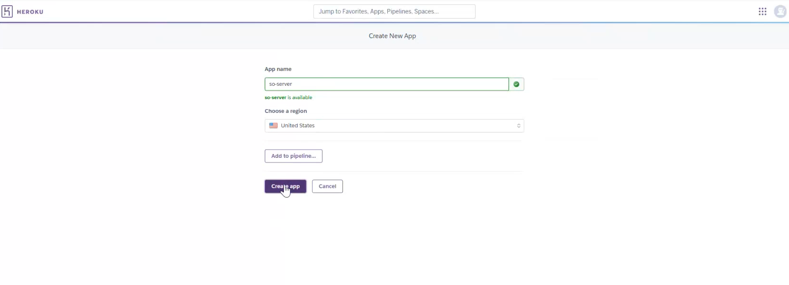
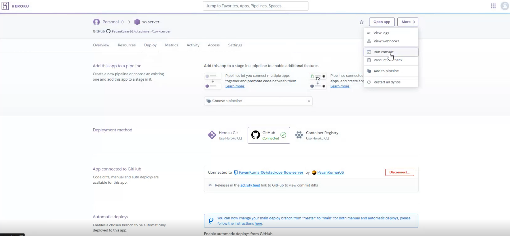
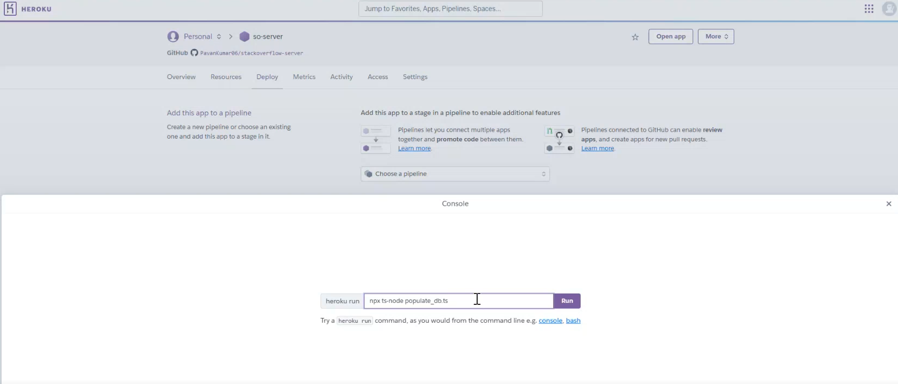

# Steps to Set Up Heroku Deployment for Your Backend Service

## Step 1: Enroll in GitHub Student Developer Pack and Heroku for Students

1. **Enroll in GitHub Student Developer Pack**
   * Visit GitHub Education and select **"Get student benefits"**. Follow the instructions to apply. Approval can take up to 2 business days.

2. **Set Up Heroku for Students**
   * Go to Heroku.com and create an account (use the same email as your GitHub account).
   * Enroll in the Heroku for Students offer, which requires the GitHub Student Developer Pack.
      * **Note**: You'll need to add a credit card for the platform credits that Heroku provides for student use.
   * After approval, you should see these credits in the billing section of your Heroku account within a few hours. **Wait to create an app until credits are available.**

## Step 2: Create a New Application on Heroku

1. **Navigate to the Heroku Dashboard**
   * After logging into Heroku, go to your Dashboard.

2. **Create a New App**
   * Select **New -> Create New App**.
   * Choose a descriptive app name (this will form part of your app's URL).
   * Click **Create App** to proceed.

   

## Step 3: Connect to GitHub for Continuous Deployment

1. **Connect to GitHub Repository**
   * In your Heroku app dashboard, scroll to the **Deployment method** section and select **GitHub**.
   * Click **Connect to GitHub** and search for your repository.
   * Select the repository containing your backend service code.

   

2. **Configure Required Files**
   * Download the necessary configuration files from the assets folder:
     * [`package.json`](assets/heroku-deployment/package.json) - Contains required dependencies and scripts
     * [`tsconfig.json`](assets/heroku-deployment/tsconfig.json) - TypeScript configuration

## Step 4: Deploy the Code

1. **Manual Deployment**
   * Configure the Manual deploy option in Heroku. Everytime you push a change to your main branch, you will have to login to Heroku and click on the Deploy Branch button.
   * In Heroku, scroll to the **Manual deploy** section.
   * Choose the main (or preferred deployment) branch.
   * Click **Deploy Branch** to deploy your application manually.

    

2. **Automatic Deployment Option**
   * Configure the Automatic deploy option in Heroku. Everytime you push a change to your main branch, Heroku will automatically publish your changes.
   * In Heroku, scroll to the **Automatic deploys** section.
   * Choose the main (or preferred deployment) branch.
   * Click **Enable Automatic Deploys** to deploy your application automatically.

## Step 5: Database Initialization and Environment Variables

1. **Set Up Environment Variables**
   * In your Heroku dashboard, go to **Settings -> Config Vars**
   * Add your MongoDB connection string as a config var:
     ```
     Key: MONGODB_URI
     Value: mongodb+srv://dspavankumar99:<password>@assignment.wmfzac9.mongodb.net

     Key: PORT
     Value: 8000
     ```
   * Replace `<password>` with your actual MongoDB password.
   * Make sure this matches the URI in your Mongo Cloud.
   * Another option is to add the .env file to your server repository.

2. **Run Database Initialization**
   * Once deployed, go to **More -> Run Console** in Heroku

    

   * Run your database population command:
     ```
     npx ts-node populate_db.ts mongodb+srv://dspavankumar99:<password>@assignment.wmfzac9.mongodb.net/fake_so
     ```
   * Note: Make sure to replace `<password>` with your actual MongoDB password.

   

3. **Verify Database Connection**
   * Check your application logs in Heroku to confirm successful database connection.
   * Verify that your data has been properly populated in MongoDB Atlas.