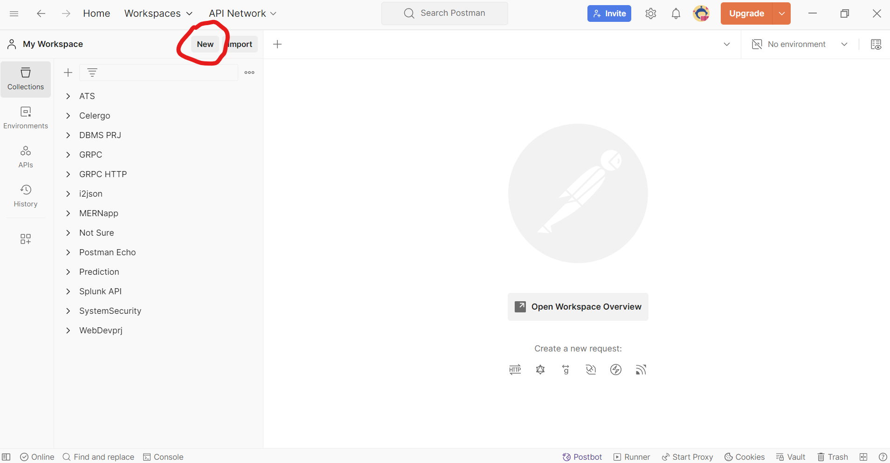
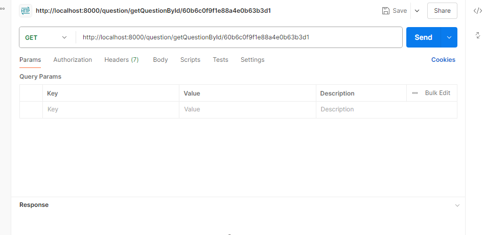

# Tutorial: How to Install and Use Postman

## Introduction to Postman

Postman is a popular API testing tool that allows developers to build, test, and modify APIs quickly and easily. It provides a interface to interact with APIs and simplifies API development. Postman supports making requests like GET, POST, PUT, DELETE, and more.

With Postman, you can:
- **Send requests to APIs** to retrieve or submit data.
- **Test API responses** to ensure that they return the expected results.

## Steps to Install Postman

### Step 1: Download Postman
1. Open your web browser and navigate to the official Postman website: [https://www.postman.com/downloads/](https://www.postman.com/downloads/).
2. Select the version that is compatible with your operating system (Windows/macOS).
3. Click the "Download" button.

### Step 2: Install Postman

#### For Windows:
1. Once the download is complete, find the setup file in your downloads folder (typically named `Postman-win64-setup.exe`).
2. Double-click the file to start the installation.
3. Follow the on-screen instructions to complete the installation. Postman will install automatically and open once the process is finished.

#### For macOS:
1. Open the downloaded `.dmg` file.
2. Drag the Postman app icon into the "Applications" folder.
3. Once copied, go to your Applications folder and double-click the Postman icon to launch the app.

### Step 3: Create an Account (Optional but Recommended)
Once Postman is installed:
1. Open the Postman application.
2. You will be prompted to sign in or create a Postman account.

## Using Postman: Basic Steps

### Step 1: Launch Postman
After installation, launch Postman. You’ll see a workspace where you can start creating requests.

### Step 2: Make Your First API Request
1. Click on the “New” button at the top-left and select **HTTP**.



2. In the request window, choose the type of request method (GET, POST, PUT, DELETE) from the dropdown menu (default is GET).
3. Enter the URL of the API you want to test in the input field (e.g., `https://localhost:8000/api/users`).



4. To send a POST request you need to include the Body as well.
    - Go to the **Body** tab.
    - Select **raw**.
    - Choose **JSON** as the format.
    - Enter the JSON data in this format:
    ```json
    {
        "username": "testuser",
        "email": "test@example.com"
    }
    ```


5. Click the **Send** button (make sure your backend is running).

### Step 3: View the Response
- After clicking "Send," Postman will display the API response below the request window.
- You will see the **Status Code**, **Response Body**, **Headers**, and **Cookies** (if applicable).
